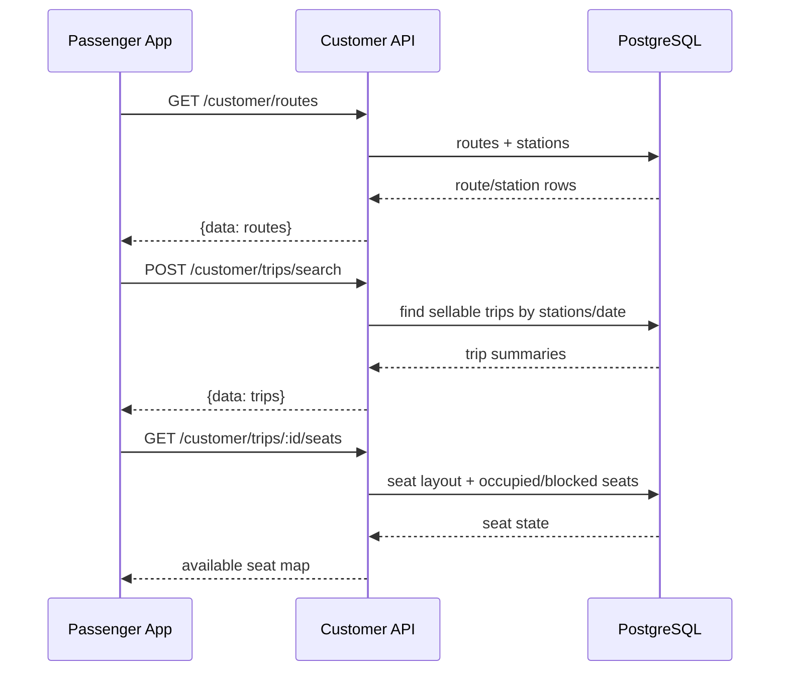
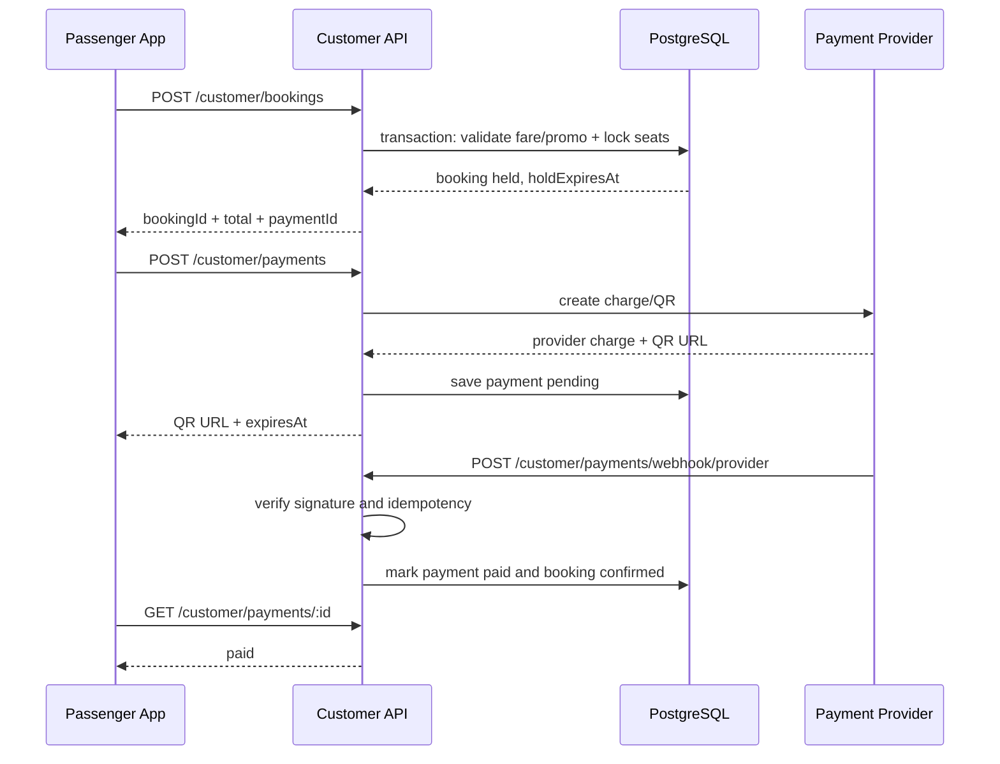
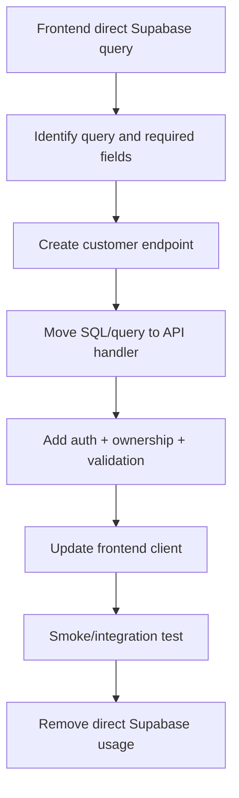

# API Migration Analysis: `nova-ticket` → `nova-express-1/api`

เอกสารนี้เป็นผลการตรวจสอบแบบ read-only ของ API ที่แอป `nova-ticket` ใช้อยู่ในปัจจุบัน เทียบกับ endpoint ที่มีอยู่ใน `nova-express-1/api`

**ขอบเขต:** ระบบปลายทางมีเฉพาะลูกค้าที่สมัคร/ล็อกอินเอง ค้นหาเที่ยวรถ เลือกที่นั่ง จอง และชำระเงินเอง ไม่มี flow พนักงานขาย ไม่มี counter sale และไม่มีบัญชีผู้ดูแลใน customer API

ขอบเขตของเอกสาร:

- ตรวจ path, HTTP method, request และ response ที่ frontend ปัจจุบันเรียก
- ตรวจ endpoint และ OpenAPI contract ใน `nova-express-1/api`
- ระบุ endpoint ที่ใช้แทนได้ทันที, ใช้ได้หลังปรับ adapter/contract และ endpoint ที่ต้องเขียนใหม่
- ระบุจุดที่ frontend อ่าน Supabase โดยตรงและแนวทางย้ายไป backend API
- ยังไม่มีการแก้ source code, database migration หรือ OpenAPI

## 1. สรุปผลสำหรับการตัดสินใจ

ไม่ควรเปลี่ยน base URL ของแอปไปยัง `nova-express-1/api` แล้วใช้ path เดิมทั้งหมด เพราะ path, schema และ response ยังไม่ตรงกับ customer flow:

| หัวข้อ | `nova-ticket` ปัจจุบัน | `nova-express-1/api` ตาม scope นี้ |
|---|---|---|
| กลุ่มผู้ใช้ | ลูกค้า/ผู้โดยสารที่จองเอง | ลูกค้า/ผู้โดยสารที่จองเอง |
| Base path | `/api/...` | `/api/v1/...` |
| Authentication | email/password, LINE, refresh token | customer email/password, LINE และ refresh token |
| รูปแบบข้อมูล | object/array ตรง ๆ เป็นส่วนใหญ่ | `{ data, meta }` เป็นส่วนใหญ่ |
| Pagination | `page`, `limit` | `offset`, `limit` |
| Booking | จองออนไลน์โดยลูกค้า | จองออนไลน์โดยลูกค้า |
| Payment | QR, Alipay, WeChat และสถานะ payment | endpoint ที่ตรวจพบมี `POST /bookings` เป็น cash flow จึงต้องเพิ่ม online payment |
| Database access | มีการ query Supabase จาก browser โดยตรง | API query PostgreSQL จาก server |

ข้อสรุปคือควรใช้สองชั้นร่วมกัน:

1. Reuse query และ business logic ที่เหมาะสมจาก API ใหม่ เช่น routes, route stops, trips, seat layout, fares และ products
2. ทำให้ทุก endpoint เป็น customer-facing และใช้ customer token/ownership เดียวกัน
3. เพิ่ม endpoint ที่ขาด เช่น register, LINE login, online payment, promotions, points, wallet และ tracking
4. ย้าย Supabase access ทั้งหมดไปอยู่หลัง API ก่อนถอด Supabase client ออกจาก frontend

## 2. สถานะการรองรับ

คำอธิบายสถานะ:

- **ใช้ได้เลย** — path/method และความหมายใกล้เคียงกันมาก ใช้โดยเปลี่ยน base path หรืออ่าน response wrapper เล็กน้อย
- **ใช้ได้หลังปรับ** — มี resource เดียวกัน แต่ request, response, authorization หรือ semantics ต่างกัน ต้องมี adapter หรือแก้ contract
- **ต้องเขียนใหม่** — API ใหม่ไม่มี resource หรือ business flow นี้
- **ไม่ควรใช้แทน** — มี path ชื่อใกล้กัน แต่คนละกลุ่มผู้ใช้/ความปลอดภัย/ธุรกิจ

## 3. Inventory ของ API เดิม

### 3.1 Authentication และผู้ใช้

| Path เดิม | Method | Request | Response ที่ frontend คาดหวัง | สถานะกับ API ใหม่ |
|---|---|---|---|---|
| `/api/auth/login` | POST | `{ email, password }` | `{ token, refresh_token?, user? }` | **ต้องปรับเป็น customer login**; request ใหม่ยังคงใช้ email/password |
| `/api/auth/register` | POST | `{ fullName, phone, email, password }` | token + user | **ต้องเขียนใหม่** |
| `/api/auth/line` | POST | `{ lineAccessToken }` | token + user | **ต้องเขียนใหม่** |
| `/api/auth/refresh` | POST | `{ refresh_token }` | token ชุดใหม่ | **ต้องเขียนใหม่** |
| `/api/auth/logout` | POST | `refresh_token` + Bearer | success | **ใช้ได้หลังปรับ**; ต้องลบ customer session |
| `/api/users/me` | GET | Bearer | passenger profile | **ต้องเพิ่ม customer profile endpoint** |
| `/api/users/me` | PATCH | profile fields | passenger profile | **ต้องเขียนใหม่** |

### 3.2 เส้นทาง จังหวัด จุดขึ้นลง และเที่ยวรถ

| Path เดิม | Method | Request | Response | สถานะ |
|---|---|---|---|---|
| `/api/routes` | GET | ไม่มี | route list ที่ frontend map เป็น `g_route_id` | **ใช้ได้หลังปรับ** จาก `/api/v1/routes`; response ใหม่เป็น paginated และ field ต่างกัน |
| `/api/provinces` | GET | `routeId?` | provinces พร้อม `routeIds` | **ต้องเขียนใหม่หรือเพิ่ม customer projection**; API ใหม่มี stations/routes แต่ไม่มี provinces model แบบเดิม |
| `/api/boarding-points` | GET | `provinceId?` | boarding points | **ใช้ได้หลังปรับ** จาก `/api/v1/stations` แต่ต้อง filter และ map เป็น province/boarding point |
| `/api/bus-stops` | GET | `routeId` | stops พร้อม `stopOrder` | **ใช้ได้หลังปรับ** จาก `/api/v1/route-stops?routeId=` |
| `/api/trips` | POST | `{ routeId?, originProvinceId, destinationProvinceId, date?, passengerCount?, sort? }` | trip array | **ต้องเขียนใหม่เป็น customer search**; API ใหม่มี `GET /api/v1/sale-trips?serviceDate=` แต่ค้นตาม origin/destination ไม่ได้ |
| `/api/trips/:id` | GET | trip id | trip detail | **ใช้ได้หลังปรับ** จาก `/api/v1/sale-trips/:id`; ต้องเปิด customer authorization |
| `/api/trips/:id/seats` | GET | trip id | `{ tripId, layout, seats }` | **ใช้ได้หลังปรับ** จาก `/api/v1/sale-trips/:id`; response ใหม่รวม occupied/blocked seats |
| `/api/trips/:id/add-ons` | GET | `page`, `limit` | add-ons | **ใช้ได้หลังปรับ** จาก `/api/v1/products`; ต้องกำหนด product scope และ mapping |

### 3.3 Booking, ticket และ tracking

| Path เดิม | Method | Request | Response | สถานะ |
|---|---|---|---|---|
| `/api/bookings` | POST | trip/date/stations/passengers/promo/add-ons/payment | booking id/status/total | **ใช้ได้หลังปรับมาก** จาก `/api/v1/bookings`; ต้องตัด cash/branch semantics และรองรับ customer payment |
| `/api/bookings` | GET | `page`, `limit` + Bearer | bookings ของผู้ใช้ | **ต้องเขียน customer variant**; API ใหม่ list bookings ตามบริษัท/สาขา |
| `/api/bookings/:id` | GET | id + Bearer | booking/ticket detail | **ใช้ได้หลังปรับ** จาก `/api/v1/bookings/:id/ticket` แต่ต้องตรวจ owner/customer |
| `/api/bookings/:id/cancel` | PATCH | body ว่าง | success/message | **ต้องเขียนใหม่หรือเพิ่ม customer refund/cancel policy**; API ใหม่ใช้ refund flow |
| `/api/checkin/self` | POST | `{ ticketNumber, qrCode }` | check-in result | **ต้องเขียนใหม่** |
| `/api/trips/:id/driver-location` | GET | Bearer | driver location | **ต้องเขียนใหม่** |
| `/api/trips/:id/passenger-location` | POST | `{ latitude, longitude, accuracy_m }` | update result | **ต้องเขียนใหม่** |

### 3.4 Payment

| Path เดิม | Method | Request | Response | สถานะ |
|---|---|---|---|---|
| `/api/payment/qr` | POST | amount + booking detail | charge id + QR URL | **ต้องเขียนใหม่** |
| `/api/payment/alipay-qr` | POST | amount + booking detail | charge id + QR URL | **ต้องเขียนใหม่** |
| `/api/payment/wechat-pay` | POST | amount + booking detail | charge id + QR URL | **ต้องเขียนใหม่** |
| `/api/payment/transaction/:chargeId` | GET | charge id | payment status/detail | **ต้องเขียนใหม่** |
| `/api/payment/cancel/:chargeId` | POST | body ว่าง | cancelled result | **ต้องเขียนใหม่** |

API ใหม่มี payment semantics เป็นเงินสดใน `POST /api/v1/bookings` จึงไม่สามารถใช้แทน online payment ได้

### 3.5 Promotion, points, wallet และเนื้อหา

| Path เดิม | Method | Request | สถานะ |
|---|---|---|---|
| `/api/promotions` | GET | member/route/day/time/phone filters | **ต้องเขียนใหม่** |
| `/api/promotions/:id` | GET | id | **ต้องเขียนใหม่** |
| `/api/promotions/validate` | POST | `{ promoCode, tripId }` | **ต้องเขียนใหม่** |
| `/api/points` | GET | Bearer | **ต้องเขียนใหม่** |
| `/api/points/history` | GET | Bearer | **ต้องเขียนใหม่** |
| `/api/wallet` | GET | Bearer | **ต้องเขียนใหม่** |
| `/api/preferences` | GET | ไม่มี | **ต้องเขียนใหม่หรือรวมใน customer config** |
| `/api/contents/faqs` | GET | `category?` | **ต้องเขียนใหม่** |
| `/api/complaints` | POST | complaint fields | **ต้องเขียนใหม่** |

## 4. Endpoint ใน `nova-express-1/api` ที่มีอยู่แล้ว

### 4.1 ใช้เป็นฐานได้ทันที

รายการนี้มี handler และ OpenAPI อยู่แล้ว และสามารถนำมาเป็น backend building block ของ customer API ได้ โดยต้องตรวจ customer authorization และ response contract ให้ตรงกับแอป:

| Endpoint ใหม่ | Method | Request/Query | Response หลัก | ใช้กับของเดิม |
|---|---|---|---|---|
| `/api/v1/auth/login` | POST | `{username,password}` ในโค้ดปัจจุบัน | `{data: auth}` | ต้องเปลี่ยน request เป็น customer `{email,password}` |
| `/api/v1/auth/me` | GET | Bearer | `{data: user, group, permissions}` ในโค้ดปัจจุบัน | ต้องปรับ response เป็น customer profile |
| `/api/v1/auth/logout` | POST | Bearer | `{data:{loggedOut:true}}` | ใช้เป็นฐาน customer logout ได้หลังเปลี่ยน session model |
| `/api/v1/routes` | GET | `limit`, `offset` | `{data:[routes],meta}` | route catalog |
| `/api/v1/route-stops` | GET | `routeId`, `limit`, `offset` | `{data:[stops],meta}` | bus stops |
| `/api/v1/trips` | GET | `serviceDate?`, `limit`, `offset` | `{data:[trips],meta}` | ใช้เป็น source ภายในสำหรับ customer trip search |
| `/api/v1/sale-trips` | GET | `serviceDate` | `{data:{trips,availableDates,settings}}` | customer trip source candidate |
| `/api/v1/sale-trips/:id` | GET | trip id | `{data:{trip,stops,passengerTypes,fares,occupiedSeats,blockedSeats}}` | trip detail + seats |
| `/api/v1/stations` | GET | `limit`, `offset` | `{data:[stations],meta}` | boarding/drop-off source |
| `/api/v1/passenger-types` | GET | `limit`, `offset` | `{data:[passengerTypes],meta}` | passenger type selector |
| `/api/v1/products` | GET | filters, `limit`, `offset` | `{data:[products],meta}` | add-ons candidate |
| `/api/v1/bookings` | POST | `BookingInput` | `{data: booking}`, status 201 | ต้องปรับเป็น customer booking โดยไม่บังคับ branch/cash |
| `/api/v1/bookings` | GET | `limit`, `offset` | `{data:[bookings],meta}` | ต้อง filter ด้วย customer token |
| `/api/v1/bookings/:id/ticket` | GET | booking id | `{data: printable ticket}` | ticket data candidate |
| `/api/v1/bookings/:id/refund` | POST | refund request | `{data: refund}`, status 201 | refund base |
| `/api/v1/refunds` | GET | `limit`, `offset` | `{data:[refunds],meta}` | customer ต้องเห็นเฉพาะ refund ของตนเอง หรือใช้ใน booking detail |

### 4.2 ต้องปรับก่อนนำมาใช้กับ `nova-ticket`

1. **Authentication** — ใช้ customer account/session สำหรับ email, LINE และ refresh token
2. **Authorization** — customer เห็นเฉพาะ booking ของตนเองผ่าน `customerId` จาก token
3. **Response adapter** — แปลง `{data,meta}` เป็นรูปแบบที่ `src/services/api.ts` และหน้าจอเดิมคาดหวัง หรือแก้ client ให้ใช้ contract ใหม่ทั้งชุด
4. **Field mapping** — API ใหม่ใช้ UUID, station fields และ snake_case หลายจุด; frontend เดิมใช้ province/route fields แบบเดิมและบางส่วนเป็น camelCase
5. **Pagination** — แปลง `page` เป็น `offset = (page - 1) * limit`
6. **Customer scope** — customer booking ไม่ต้องส่ง `branchId` หรือข้อมูลพนักงาน
7. **Payment** — ต้องแยก online payment ก่อน reuse booking transaction

### 4.3 คำตอบแบบชัดเจนว่า “ใช้ได้เลย” หรือ “ต้องเพิ่ม”

| Resource ใน new endpoint | ใช้ได้เลยหรือไม่ | งานที่ต้องเพิ่มก่อนให้ `nova-ticket` เรียก |
|---|---|---|
| `GET /api/v1/routes` | **ใช้ได้เลยในด้านข้อมูล** | client unwrap `{data}` และกำหนด default `limit/offset`; ถ้าต้องการ public route ให้ไม่บังคับ login |
| `GET /api/v1/route-stops` | **ใช้ได้เลยในด้านข้อมูล** | ส่ง `routeId`, map `station_id/stop_order` เป็น DTO เดิม และเพิ่ม filter จุดขึ้น/ลง |
| `GET /api/v1/stations` | **ใช้ได้หลังปรับเล็กน้อย** | map station เป็น boarding point/province และเพิ่ม query filter |
| `GET /api/v1/passenger-types` | **ใช้ได้หลังปรับเล็กน้อย** | map `code/name`; เพิ่ม field ที่ frontend ต้องใช้ถ้าต้องการ `requiresDocument` |
| `GET /api/v1/sale-trips` | **ใช้ได้หลังเพิ่ม customer access** | รับ `serviceDate`, filter route/stations, ตัดข้อมูลภายใน และคืน customer DTO |
| `GET /api/v1/sale-trips/:id` | **ใช้ได้หลังเพิ่ม customer access** | ตรวจ trip ที่เปิดขาย, map seat state, ตัดข้อมูลภายใน |
| `GET /api/v1/products` | **ใช้ได้หลังปรับ scope** | filter เฉพาะ add-ons ที่ซื้อกับ trip/customer ได้ และ map response |
| `POST /api/v1/bookings` | **ใช้ไม่ได้ตรง ๆ** | เปลี่ยน request เป็น customer booking, ตัด branch/cash requirement, เพิ่ม seat hold/promo/payment และ customer ownership |
| `GET /api/v1/bookings` | **ใช้ไม่ได้ตรง ๆ** | filter ด้วย customer token, ห้ามรับ customerId จาก query และเพิ่ม status/date filters |
| `GET /api/v1/bookings/:id/ticket` | **ใช้ได้หลังเพิ่ม ownership** | ตรวจว่า booking เป็นของ customer, map ticket response และ QR |
| `POST /api/v1/bookings/:id/refund` | **ใช้เป็นฐาน refund ได้** | เพิ่ม customer cancel policy, ownership, payment provider refund และ response สำหรับลูกค้า |
| `POST /api/v1/auth/login` | **ใช้ไม่ได้ตรง ๆ** | เปลี่ยนเป็น customer email/password และ customer token |
| `GET /api/v1/auth/me` | **ใช้ไม่ได้ตรง ๆ** | เปลี่ยน DTO เป็น customer profile ไม่คืน permission/group ภายใน |
| `POST /api/v1/auth/logout` | **ใช้เป็นฐานได้หลังปรับ session** | revoke customer refresh/access session |

ดังนั้นกลุ่มที่ “ใช้ได้เลย” จริงในรอบแรกคือข้อมูล catalog ที่ไม่เกี่ยวกับเจ้าของข้อมูล ได้แก่ routes และ route stops หลังเพิ่มเพียง response adapter ส่วน authentication, booking, payment และข้อมูลส่วนตัวต้องเพิ่มเติมก่อนทั้งหมด

## 5. Endpoint ที่ต้องเขียนเพิ่ม

แนะนำ namespace แยกดังนี้:

```text
/api/v1/customer/...
```

### 5.1 Customer authentication

#### `POST /api/v1/customer/auth/register`

Request:

```json
{
  "fullName": "สมชาย ใจดี",
  "phone": "0812345678",
  "email": "user@example.com",
  "password": "secret"
}
```

Response `201`:

```json
{
  "data": {
    "accessToken": "...",
    "refreshToken": "...",
    "user": {
      "id": "uuid",
      "fullName": "สมชาย ใจดี",
      "phone": "0812345678",
      "email": "user@example.com"
    }
  }
}
```

#### `POST /api/v1/customer/auth/login`

Request: `{ email, password }`

Response: รูปแบบเดียวกับ register

#### `POST /api/v1/customer/auth/line`

Request: `{ lineAccessToken }`

Response: access/refresh token และ customer profile

#### `POST /api/v1/customer/auth/refresh`

Request: `{ refreshToken }`

Response: `{ data: { accessToken, refreshToken } }`

#### `POST /api/v1/customer/auth/logout`

Request: `{ refreshToken? }` + Bearer

Response: `{ data: { loggedOut: true } }`

#### `GET /api/v1/customer/me`

Request: Bearer

Response: `{ data: PassengerProfile }`

#### `PATCH /api/v1/customer/me`

Request fields ที่อนุญาต: `fullName`, `phone`, `email`, `avatarUrl`, `idType`, `idNumber`

Response: profile ที่แก้แล้ว

### 5.2 Customer catalog และ trip search

| Path | Method | Request | Response |
|---|---|---|---|
| `/api/v1/customer/config` | GET | company/host context | company detail, sales settings, preferences |
| `/api/v1/customer/routes` | GET | `limit`, `offset` | `{data:[Route],meta}` |
| `/api/v1/customer/provinces` | GET | `routeId?` | `{data:[Province]}` |
| `/api/v1/customer/boarding-points` | GET | `provinceId?`, `routeId?` | `{data:[BoardingPoint]}` |
| `/api/v1/customer/route-stops` | GET | `routeId` | `{data:[RouteStop]}` |
| `/api/v1/customer/trips/search` | GET or POST | origin/destination/date/passengers/sort | `{data:[TripSummary]}` |
| `/api/v1/customer/trips/:id` | GET | trip id | `{data:{trip,stops,fares,passengerTypes}}` |
| `/api/v1/customer/trips/:id/seats` | GET | trip id | `{data:{layout,seats,occupiedSeats,blockedSeats}}` |
| `/api/v1/customer/trips/:id/add-ons` | GET | `limit`, `offset` | `{data:[Product],meta}` |

ข้อเสนอ: ใช้ `POST /trips/search` หากต้องการรักษา request เดิมที่มี body และรองรับ filter เพิ่มในอนาคต; ใช้ `GET` หากต้องการ cache/search URL ได้ง่าย

### 5.3 Customer booking

#### `POST /api/v1/customer/bookings`

Request ที่แนะนำ:

```json
{
  "tripId": "uuid",
  "travelDate": "2026-08-13",
  "originStationId": "uuid",
  "destinationStationId": "uuid",
  "contactName": "สมชาย ใจดี",
  "contactPhone": "0812345678",
  "contactEmail": "user@example.com",
  "promoCode": "PROMO10",
  "useStamp": false,
  "passengers": [
    {
      "seatId": "uuid",
      "seatNumber": "A1",
      "fullName": "สมหญิง ใจดี",
      "thaiId": "1234567890123",
      "phone": "0812345678",
      "passengerType": "adult"
    }
  ],
  "addOns": [
    { "productId": "uuid", "quantity": 1 }
  ],
  "paymentMethod": "promptpay"
}
```

Response `201`:

```json
{
  "data": {
    "bookingId": "uuid",
    "bookingNo": "BK-20260813-0001",
    "status": "pending_payment",
    "subtotal": 500,
    "discountAmount": 50,
    "addOnAmount": 0,
    "total": 450,
    "paymentId": "uuid",
    "holdExpiresAt": "2026-08-13T12:05:00Z"
  }
}
```

กติกาที่ควรอยู่ server:

- ตรวจว่า trip ยังเปิดขายและวันที่ตรงกัน
- lock seat และป้องกัน double booking ใน transaction
- คำนวณ fare และส่วนลดเอง ห้ามเชื่อยอดเงินจาก frontend
- validate promo จาก server
- กำหนดเวลาถือที่นั่ง (`holdExpiresAt`)
- ผูก `customerId` กับ booking

#### `GET /api/v1/customer/bookings`

Query: `status?`, `limit`, `offset`

Response:

```json
{
  "data": [
    {
      "id": "uuid",
      "bookingNo": "BK-20260813-0001",
      "status": "confirmed",
      "tripId": "uuid",
      "routeName": "กรุงเทพฯ - เชียงใหม่",
      "serviceDate": "2026-08-13",
      "scheduledDeparture": "2026-08-13T08:00:00+07:00",
      "totalAmount": 450
    }
  ],
  "meta": { "limit": 10, "offset": 0 }
}
```

#### `GET /api/v1/customer/bookings/:id`

Response ควรรวม ticket, passengers, seats, payment, company contact และ QR/ticket data

#### `POST /api/v1/customer/bookings/:id/cancel`

Request: `{ reason? }`

Response: `{ data: { id, status, refundId?, refundAmount? } }`

### 5.4 Payment

| Path | Method | Request | Response |
|---|---|---|---|
| `/api/v1/customer/payments` | POST | `{bookingId, method}` | payment id, provider charge id, QR URL, status, expiry |
| `/api/v1/customer/payments/:id` | GET | payment id | amount, status, paidAt, failure reason |
| `/api/v1/customer/payments/:id/cancel` | POST | ไม่มี | cancelled status |
| `/api/v1/customer/payments/webhook/:provider` | POST | provider payload + signature | acknowledgment |

รองรับ `method`: `promptpay`, `alipay`, `wechat_pay_mpm` ตาม API เดิม โดย backend เป็นผู้เรียก provider และตรวจ webhook/signature

### 5.5 Promotions, points, wallet, FAQ และ complaint

| Path | Method | Request | Response |
|---|---|---|---|
| `/api/v1/customer/promotions` | GET | `memberOnly`, `visibility`, `routeId`, `dayOfWeek`, `time`, `phone` | promotion list |
| `/api/v1/customer/promotions/:id` | GET | id | promotion detail |
| `/api/v1/customer/promotions/validate` | POST | `{promoCode,tripId}` | valid, discount, message |
| `/api/v1/customer/points` | GET | Bearer | point summary |
| `/api/v1/customer/points/history` | GET | Bearer, pagination | point transactions |
| `/api/v1/customer/wallet` | GET | Bearer | balance + transactions |
| `/api/v1/customer/faqs` | GET | `category?` | FAQ list |
| `/api/v1/customer/complaints` | POST | reporter/trip/seat/vehicle/text | complaint record |

### 5.6 Check-in และ tracking

| Path | Method | Request | Response |
|---|---|---|---|
| `/api/v1/customer/check-in` | POST | `{ticketNumber,qrCode}` | checked-in status/time |
| `/api/v1/customer/trips/:id/driver-location` | GET | Bearer | latitude, longitude, timestamp, accuracy |
| `/api/v1/customer/trips/:id/passenger-location` | POST | `{latitude,longitude,accuracy_m}` | accepted timestamp |

ต้องตรวจ customer ownership และสถานะตั๋วทุกครั้ง ไม่ควรให้ผู้ใช้ส่ง `userId` มาเอง

## 5.7 Complete customer contract: request/params/response ครบทุก path

ส่วนนี้เป็น contract ที่ต้องใช้เป็นข้อกำหนดก่อนเขียน handler จริง ทุก endpoint ที่ต้องปรับหรือเขียนใหม่มี method, path parameter, query parameter, request body, success response และ error response ระบุไว้แล้ว

ตารางในหัวข้อ 3 เป็น inventory ของ legacy API เพื่อบอกสิ่งที่ frontend เรียกอยู่ ส่วน request/params/response ที่ต้องใช้กับ endpoint ใหม่ให้ยึด contract ในหัวข้อนี้เป็นหลัก ไม่ใช้ shorthand ใน inventory ไปสร้าง handler โดยตรง

### รูปแบบ response และ error ร่วมกัน

สำเร็จแบบ object:

```json
{ "data": {} }
```

สำเร็จแบบ list:

```json
{
  "data": [],
  "meta": { "limit": 20, "offset": 0, "total": 0 }
}
```

ผิดพลาดทุก endpoint:

```json
{
  "error": {
    "code": "VALIDATION_ERROR",
    "message": "รายละเอียดที่อ่านได้สำหรับลูกค้า"
  }
}
```

สถานะที่ควรรองรับเป็นอย่างน้อย: `400` ข้อมูลไม่ถูกต้อง, `401` ไม่ได้ล็อกอิน/Token หมดอายุ, `403` ไม่มีสิทธิ์หรือไม่ใช่เจ้าของข้อมูล, `404` ไม่พบข้อมูล, `409` ที่นั่ง/booking/payment ชนกัน, `422` ไม่ผ่านกติกาธุรกิจ และ `500` ระบบภายใน

### A. Customer authentication และ profile

| Method และ path | Params/query | Request body | Success response |
|---|---|---|---|
| `POST /api/v1/customer/auth/register` | ไม่มี | `{fullName:string, phone:string, email:string, password:string}` | `201 {data:{accessToken:string, refreshToken:string, user:Customer}}` |
| `POST /api/v1/customer/auth/login` | ไม่มี | `{email:string, password:string}` | `200 {data:{accessToken:string, refreshToken:string, user:Customer}}` |
| `POST /api/v1/customer/auth/line` | ไม่มี | `{lineAccessToken:string}` | `200 {data:{accessToken:string, refreshToken:string, user:Customer}}` |
| `POST /api/v1/customer/auth/refresh` | ไม่มี | `{refreshToken:string}` | `200 {data:{accessToken:string, refreshToken:string, user?:Customer}}` |
| `POST /api/v1/customer/auth/logout` | Bearer; ไม่มี query | `{refreshToken?:string}` | `200 {data:{loggedOut:true}}` |
| `GET /api/v1/customer/me` | Bearer; ไม่มี query | ไม่มี | `200 {data:{id,fullName,phone,email,avatarUrl?,idType?,idNumber?,points,walletBalance,createdAt}}` |
| `PATCH /api/v1/customer/me` | Bearer; ไม่มี query | อย่างน้อยหนึ่ง field จาก `{fullName?,phone?,email?,avatarUrl?,idType?,idNumber?}` | `200 {data:Customer}` |

Validation ที่สำคัญ: email ต้อง unique และ valid, password ต้องผ่านความยาวขั้นต่ำ, LINE token ต้องตรวจสอบกับ LINE provider, refresh token ต้อง revoke ได้, ห้ามคืน password/hash ใน response

### B. Customer configuration และ geography

| Method และ path | Params/query | Request body | Success response |
|---|---|---|---|
| `GET /api/v1/customer/config` | `companyCode?`, `host?` | ไม่มี | `200 {data:{company:{id,code,displayName,address,phone,currency,timezone},salesSettings:{ticketTerms,blockSalesAfterDeparture},preferences:{...}}}` |
| `GET /api/v1/customer/routes` | `limit?` 1–200, `offset?` >=0, `status?=published` | ไม่มี | `200 {data:[{id,name,originStationId,destinationStationId,origin,destination,distanceKm,durationMinutes}],meta}` |
| `GET /api/v1/customer/provinces` | `routeId?`, `limit?`, `offset?` | ไม่มี | `200 {data:[{id,name,nameEn,routeIds:string[]}],meta}` |
| `GET /api/v1/customer/boarding-points` | `provinceId?`, `routeId?`, `type?=pickup\|dropoff\|stop`, `limit?`, `offset?` | ไม่มี | `200 {data:[{id,name,nameEn,provinceId,routeId,type,stopOrder,latitude?,longitude?}],meta}` |
| `GET /api/v1/customer/route-stops` | `routeId` required UUID, `limit?`, `offset?` | ไม่มี | `200 {data:[{id,routeId,stationId,name,stopOrder,type,latitude?,longitude?}],meta}` |

Errors เพิ่มเติม: `400` เมื่อ UUID/filters ไม่ถูกต้อง, `404` เมื่อ route/province ไม่พบ

### C. Customer trip search, detail และ seat map

#### `POST /api/v1/customer/trips/search`

Request body:

```json
{
  "routeId": "uuid",
  "originProvinceId": "uuid",
  "destinationProvinceId": "uuid",
  "originStationId": "uuid",
  "destinationStationId": "uuid",
  "date": "2026-08-13",
  "passengerCount": 1,
  "sort": "asc"
}
```

`routeId`, `originProvinceId`, `destinationProvinceId`, `date` และ `passengerCount` เป็น optional ตาม UX แต่ต้องมี origin/destination ที่ resolve ได้ และ `passengerCount` ต้องเป็น integer 1–20 เมื่อส่งมา

Success `200`:

```json
{
  "data": [
    {
      "id": "uuid",
      "routeId": "uuid",
      "routeName": "กรุงเทพฯ - เชียงใหม่",
      "originStationId": "uuid",
      "destinationStationId": "uuid",
      "origin": "กรุงเทพฯ",
      "destination": "เชียงใหม่",
      "serviceDate": "2026-08-13",
      "departureTime": "2026-08-13T08:00:00+07:00",
      "arrivalTime": "2026-08-13T18:00:00+07:00",
      "vehicleType": "VIP",
      "totalSeats": 40,
      "availableSeats": 25,
      "startingFare": 500,
      "status": "planned"
    }
  ]
}
```

#### `GET /api/v1/customer/trips/:tripId`

Path param: `tripId` required UUID. ไม่มี request body/query ที่จำเป็น

Success `200`:

```json
{
  "data": {
    "trip": {"id":"uuid","routeId":"uuid","serviceDate":"2026-08-13","departureTime":"...","arrivalTime":"...","vehicleType":"VIP","status":"planned"},
    "stops": [{"stationId":"uuid","name":"หมอชิต","stopOrder":1}],
    "passengerTypes": [{"code":"adult","name":"ผู้ใหญ่"}],
    "fares": [{"originStationId":"uuid","destinationStationId":"uuid","passengerType":"adult","amount":500}],
    "salesSettings": {"ticketTerms":"..."}
  }
}
```

#### `GET /api/v1/customer/trips/:tripId/seats`

Path param: `tripId` required UUID. Query optional: `originStationId`, `destinationStationId` เพื่อคำนวณ seat availability ตามช่วงสถานี

Success `200`:

```json
{
  "data": {
    "tripId": "uuid",
    "layout": {"id":"uuid","name":"2+2","rows":[["A1","A2"],["B1","B2"]]},
    "seats": [{"id":"uuid","number":"A1","row":1,"col":1,"floor":1,"status":"available"}],
    "occupiedSeats": ["B1"],
    "blockedSeats": ["A4"],
    "availableSeats": 25
  }
}
```

### D. Add-ons/products

`GET /api/v1/customer/trips/:tripId/add-ons`

- Query: `limit?` 1–100, `offset?` >=0, `categoryId?`, `activeOnly?=true`
- Body: ไม่มี
- Success: `200 {data:[{id,productId,title,description,unitPrice,currency,stock,active}],meta}`
- Errors: `401` หาก product ต้องล็อกอิน, `404` หาก trip ไม่พบ, `400` หาก pagination ไม่ถูกต้อง

### E. Customer booking และ ticket

| Method และ path | Params/query | Request body | Success response |
|---|---|---|---|
| `POST /api/v1/customer/bookings` | Bearer; ไม่มี query | ดู JSON booking ด้านล่าง | `201 {data:{bookingId,bookingNo,status,subtotal,discountAmount,addOnAmount,total,paymentId?,holdExpiresAt}}` |
| `GET /api/v1/customer/bookings` | Bearer; `status?`, `from?`, `to?`, `limit?`, `offset?` | ไม่มี | `200 {data:[BookingSummary],meta}` เฉพาะ customer จาก token |
| `GET /api/v1/customer/bookings/:bookingId` | Bearer; path `bookingId` UUID | ไม่มี | `200 {data:BookingDetail}` เฉพาะเจ้าของ booking |
| `POST /api/v1/customer/bookings/:bookingId/cancel` | Bearer; path `bookingId` UUID | `{reason?:string}` | `200 {data:{bookingId,status:"cancelled",refundId?,refundAmount?,cancelledAt}}` |
| `GET /api/v1/customer/bookings/:bookingId/ticket` | Bearer; path `bookingId` UUID | ไม่มี | `200 {data:{bookingNo,qrCode,ticketTerms,company,trip,seats,passengers,payment}}` |

Request `POST /customer/bookings`:

```json
{
  "tripId": "uuid",
  "travelDate": "2026-08-13",
  "originStationId": "uuid",
  "destinationStationId": "uuid",
  "contactName": "สมชาย ใจดี",
  "contactPhone": "0812345678",
  "contactEmail": "user@example.com",
  "promoCode": "PROMO10",
  "useStamp": false,
  "passengers": [{"seatId":"uuid","seatNumber":"A1","fullName":"สมหญิง ใจดี","thaiId":"1234567890123","phone":"0812345678","passengerType":"adult"}],
  "addOns": [{"productId":"uuid","quantity":1}],
  "paymentMethod": "promptpay"
}
```

`paymentMethod` รับ `promptpay`, `alipay`, `wechat_pay_mpm`, `wallet` หรือ `pay_later` ตาม policy ของระบบ หากไม่ชำระทัน `holdExpiresAt` ให้ระบบปล่อยที่นั่งอัตโนมัติ

`BookingSummary` ต้องมีอย่างน้อย: `id`, `bookingNo`, `status`, `tripId`, `routeName`, `serviceDate`, `scheduledDeparture`, `scheduledArrival`, `seatNumbers`, `totalAmount`, `paymentStatus`, `createdAt`

`BookingDetail` ต้องมีอย่างน้อย: summary fields, contact, passengers, seats, fare breakdown, add-ons, promo, payment, QR/ticket, company contact และ cancellation/refund policy

### F. Online payment

| Method และ path | Params/query | Request body | Success response |
|---|---|---|---|
| `POST /api/v1/customer/payments` | Bearer | `{bookingId:string, method:"promptpay"\|"alipay"\|"wechat_pay_mpm"\|"wallet"}` | `201 {data:{paymentId,bookingId,provider,providerChargeId?,amount,currency,status,qrCodeUrl?,deepLinkUrl?,expiresAt}}` |
| `GET /api/v1/customer/payments/:paymentId` | Bearer; path UUID | ไม่มี | `200 {data:{paymentId,bookingId,amount,currency,method,status,paidAt?,failedAt?,expiresAt,providerReference?}}` |
| `POST /api/v1/customer/payments/:paymentId/cancel` | Bearer; path UUID | `{reason?:string}` | `200 {data:{paymentId,status:"cancelled",cancelledAt}}` |
| `POST /api/v1/customer/payments/webhook/:provider` | ไม่ใช้ customer Bearer; provider signature header required | raw provider payload | `200 {data:{accepted:true}}` |

Payment errors: `409 PAYMENT_ALREADY_PAID`, `409 PAYMENT_EXPIRED`, `422 PAYMENT_METHOD_NOT_AVAILABLE`, `401/403` ownership failure และ `400` provider payload invalid

### G. Promotions

| Method และ path | Params/query | Request body | Success response |
|---|---|---|---|
| `GET /api/v1/customer/promotions` | `memberOnly?`, `visibility?`, `routeId?`, `dayOfWeek?`, `time?`, `phone?`, `limit?`, `offset?` | ไม่มี | `200 {data:[{id,title,description,imageUrl,promoCode,discountPercent,discountAmount,remainingQuota,expiryDate,validityDays,memberOnly}],meta}` |
| `GET /api/v1/customer/promotions/:promotionId` | path UUID; ไม่มี query | ไม่มี | `200 {data:PromotionDetail}` |
| `POST /api/v1/customer/promotions/validate` | Bearer optional | `{promoCode:string,tripId:string,passengerCount?:number,addOns?:[{productId,quantity}]}` | `200 {data:{valid:boolean,promoCode,discountAmount,discountPercent,eligibleTotal,message?,expiresAt?}}` |

### H. Points, wallet และ content

| Method และ path | Params/query | Request body | Success response |
|---|---|---|---|
| `GET /api/v1/customer/points` | Bearer; ไม่มี query | ไม่มี | `200 {data:{totalPoints,nextRewardAt,rewardValue,updatedAt}}` |
| `GET /api/v1/customer/points/history` | Bearer; `from?`, `to?`, `type?=earn\|redeem`, `limit?`, `offset?` | ไม่มี | `200 {data:[{id,description,date,amount,points,type,bookingId?}],meta}` |
| `GET /api/v1/customer/wallet` | Bearer; `limit?`, `offset?` | ไม่มี | `200 {data:{balance,availablePoints,transactions:[{id,description,date,amount,type,bookingId?}],meta}}` |
| `GET /api/v1/customer/preferences` | `locale?`, `key?` | ไม่มี | `200 {data:{locale,timezone,features,contact,terms}}` |
| `GET /api/v1/customer/faqs` | `category?`, `locale?`, `limit?`, `offset?` | ไม่มี | `200 {data:[{id,category,question,answer,sortOrder}],meta}` |

### I. Complaint, check-in และ tracking

| Method และ path | Params/query | Request body | Success response |
|---|---|---|---|
| `POST /api/v1/customer/complaints` | Bearer optional; ไม่มี query | `{reporterPhone:string,complaintText:string,vehiclePlate?:string,tripId?:string,bookingId?:string,seatCode?:string,attachments?:string[]}` | `201 {data:{id,caseNo,status:"open",createdAt}}` |
| `POST /api/v1/customer/check-in` | Bearer; ไม่มี query | `{ticketNumber:string,qrCode:string}` | `200 {data:{checkedIn:true,bookingId,seatNumbers,checkedInAt}}` |
| `GET /api/v1/customer/trips/:tripId/driver-location` | Bearer; path UUID; `fresh?=true` | ไม่มี | `200 {data:{tripId,latitude,longitude,accuracyM,heading?,speed?,recordedAt}}` |
| `POST /api/v1/customer/trips/:tripId/passenger-location` | Bearer; path UUID | `{latitude:number,longitude:number,accuracy_m:number}` | `202 {data:{accepted:true,tripId,recordedAt}}` |

Complaint, check-in และ tracking ต้องตรวจ booking ownership หรือสิทธิ์จาก ticket ที่ยัง active ก่อนคืนข้อมูล/รับข้อมูล

## 6. Supabase ที่ต้องย้ายเป็น API contract

ส่วนนี้แปลง query ที่ `nova-ticket` เคยเรียก Supabase จาก browser ให้เป็น endpoint โดยตรง แต่ละรายการระบุ path, method, params, request และ response ที่ต้อง implement

### 6.1 Company และ sales settings

แหล่งเดิม: `src/lib/company.ts`, `src/pages/Home.tsx` — อ่าน `companies` และ relation `company_sales_settings` โดยค้นจากชื่อบริษัท

#### `GET /api/v1/customer/config`

| รายการ | รายละเอียด |
|---|---|
| Method | `GET` |
| Query params | `companyCode?: string`, `companyName?: string`; ต้องส่งอย่างใดอย่างหนึ่งเมื่อระบบมีหลายบริษัท ถ้ามี tenant จาก host จะไม่ต้องส่ง |
| Headers | `Accept: application/json`; ไม่จำเป็นต้องล็อกอินสำหรับ public config |
| Request body | ไม่มี |
| Success | `200` |

Request ตัวอย่าง:

```http
GET /api/v1/customer/config?companyCode=NOVA
Accept: application/json
```

Response:

```json
{
  "data": {
    "company": {
      "id": "uuid",
      "code": "NOVA",
      "legalName": "Nova Express Co., Ltd.",
      "displayName": "Nova Express",
      "companyAddress": "ที่อยู่บริษัท",
      "companyTell": "020000000",
      "currency": "THB",
      "timezone": "Asia/Bangkok",
      "locale": "th-TH"
    },
    "salesSettings": {
      "blockSalesAfterDeparture": true,
      "allowSalesWithoutAssignment": false,
      "ticketTerms": "เงื่อนไขการเดินทาง"
    },
    "preferences": {
      "defaultLocale": "th-TH",
      "supportPhone": "020000000"
    }
  }
}
```

Response errors: `400 CONFIG_SELECTOR_REQUIRED`, `404 COMPANY_NOT_FOUND`

### 6.2 Passenger tiers / passenger types

แหล่งเดิม: `src/components/booking/PassengerInfoSection.tsx` — query `passenger_tiers` ที่ `requires_document = false`

#### `GET /api/v1/customer/passenger-types`

| รายการ | รายละเอียด |
|---|---|
| Method | `GET` |
| Query params | `requiresDocument?: boolean` (default `false`), `status?: active`, `limit?: 1..100`, `offset?: >=0` |
| Headers | `Accept: application/json`; public ได้ถ้า passenger types ไม่ผูกสมาชิก |
| Request body | ไม่มี |
| Success | `200` |

Request ตัวอย่าง:

```http
GET /api/v1/customer/passenger-types?requiresDocument=false&status=active&limit=50&offset=0
```

Response:

```json
{
  "data": [
    {
      "id": "uuid",
      "code": "adult",
      "name": "ผู้ใหญ่",
      "nameEn": "Adult",
      "description": null,
      "requiresDocument": false,
      "sortOrder": 1,
      "status": "active"
    }
  ],
  "meta": { "limit": 50, "offset": 0, "total": 1 }
}
```

Response errors: `400 INVALID_PAGINATION`, `404 PASSENGER_TYPES_NOT_FOUND` (ถ้าต้องการแยกกรณีไม่มีข้อมูล)

### 6.3 Route list

แหล่งเดิม: `src/pages/Home.tsx` — query `routes.select('*')` และนำไปกรองตาม `region_id`

#### `GET /api/v1/customer/routes`

| รายการ | รายละเอียด |
|---|---|
| Method | `GET` |
| Query params | `regionId?: string`, `status?: published`, `originStationId?: uuid`, `destinationStationId?: uuid`, `limit?: 1..200`, `offset?: >=0` |
| Headers | `Accept: application/json`; public |
| Request body | ไม่มี |
| Success | `200` |

Request ตัวอย่าง:

```http
GET /api/v1/customer/routes?regionId=north&status=published&limit=50&offset=0
```

Response:

```json
{
  "data": [
    {
      "id": "uuid",
      "code": "BKK-CNX",
      "name": "กรุงเทพฯ - เชียงใหม่",
      "origin": {"id":"uuid","name":"กรุงเทพฯ","nameEn":"Bangkok"},
      "destination": {"id":"uuid","name":"เชียงใหม่","nameEn":"Chiang Mai"},
      "regionId": "north",
      "distanceKm": 700,
      "durationMinutes": 600,
      "status": "published"
    }
  ],
  "meta": { "limit": 50, "offset": 0, "total": 1 }
}
```

Response errors: `400 INVALID_ROUTE_FILTER`, `404 ROUTES_NOT_FOUND` (ถ้าต้องการแยกกรณีไม่มีข้อมูล)

### 6.4 Route lookup ตามต้นทางและปลายทาง

แหล่งเดิม: `src/pages/Home.tsx` — query `routes` ด้วย `origin_id` และ `destination_id` แล้วเลือก route เดียว

#### `GET /api/v1/customer/routes/lookup`

| รายการ | รายละเอียด |
|---|---|
| Method | `GET` |
| Query params | `originStationId: uuid` required, `destinationStationId: uuid` required |
| Headers | `Accept: application/json`; public |
| Request body | ไม่มี |
| Success | `200` |

Request ตัวอย่าง:

```http
GET /api/v1/customer/routes/lookup?originStationId=11111111-1111-1111-1111-111111111111&destinationStationId=22222222-2222-2222-2222-222222222222
```

Response เมื่อพบ route:

```json
{
  "data": {
    "id": "uuid",
    "code": "BKK-CNX",
    "name": "กรุงเทพฯ - เชียงใหม่",
    "originStationId": "11111111-1111-1111-1111-111111111111",
    "destinationStationId": "22222222-2222-2222-2222-222222222222",
    "origin": "กรุงเทพฯ",
    "destination": "เชียงใหม่",
    "status": "published"
  }
}
```

Response errors: `400 STATIONS_REQUIRED`, `404 ROUTE_NOT_FOUND`, `409 MULTIPLE_ROUTES_MATCH` (ถ้ามีมากกว่าหนึ่ง route และไม่สามารถเลือกอัตโนมัติ)

### 6.5 Customer bookings ที่ใช้แทน query Supabase

แหล่งเดิม: `src/pages/Home.tsx` — query `bookings` ของ user เพื่อหา ticket ที่ยังเป็น `confirmed/upcoming` และ `paymentStatus = paid` ก่อนส่งตำแหน่งผู้โดยสาร

#### `GET /api/v1/customer/bookings`

| รายการ | รายละเอียด |
|---|---|
| Method | `GET` |
| Query params | `status?: upcoming,confirmed`, `paymentStatus?: paid`, `serviceDateFrom?: YYYY-MM-DD`, `serviceDateTo?: YYYY-MM-DD`, `limit?: 1..100`, `offset?: >=0` |
| Headers | `Authorization: Bearer <customerAccessToken>` |
| Request body | ไม่มี |
| Success | `200` |

Request ตัวอย่าง:

```http
GET /api/v1/customer/bookings?status=upcoming,confirmed&paymentStatus=paid&limit=100&offset=0
Authorization: Bearer <customerAccessToken>
```

Response:

```json
{
  "data": [
    {
      "id": "uuid",
      "bookingNo": "BK-20260813-0001",
      "status": "confirmed",
      "paymentStatus": "paid",
      "tripId": "uuid",
      "serviceDate": "2026-08-13",
      "scheduledDeparture": "2026-08-13T08:00:00+07:00",
      "scheduledArrival": "2026-08-13T18:00:00+07:00",
      "routeName": "กรุงเทพฯ - เชียงใหม่",
      "seatNumbers": ["A1"],
      "totalAmount": 500
    }
  ],
  "meta": { "limit": 100, "offset": 0, "total": 1 }
}
```

การ filter ต้องมาจาก `customerId` ใน Bearer token ห้ามรับ `userId` เป็น query parameter และห้ามคืน booking ของลูกค้ารายอื่น

Response errors: `401 UNAUTHENTICATED`, `400 INVALID_BOOKING_FILTER`

### 6.6 Supabase-to-API mapping สรุป

| Supabase เดิม | API path ใหม่ | Method | Authentication |
|---|---|---|---|
| `companies` + `company_sales_settings` | `/api/v1/customer/config` | `GET` | Public/tenant context |
| `passenger_tiers` | `/api/v1/customer/passenger-types` | `GET` | Public หรือ customer token |
| `routes.select('*')` | `/api/v1/customer/routes` | `GET` | Public |
| route lookup `origin_id` + `destination_id` | `/api/v1/customer/routes/lookup` | `GET` | Public |
| `bookings` ของ customer ที่ active/paid | `/api/v1/customer/bookings` | `GET` | Customer Bearer |

ทุก endpoint ด้านบนต้องคืน DTO ที่กำหนดไว้ ไม่คืน row จาก Supabase/PostgreSQL โดยตรง และไม่เปิด `user_id`, internal payment fields หรือข้อมูลภายในที่ frontend ไม่จำเป็นต้องใช้

## 7. Diagram: ความสัมพันธ์ของระบบเดิมและระบบใหม่

```mermaid
flowchart LR
  UI[nova-ticket Passenger App]
  Old[Existing /api service]
  Supa[(Supabase tables)]
  Gateway[/api/v1 gateway]
  Customer[Customer /api/v1 API]
  DB[(PostgreSQL)]
  Pay[Payment Providers]

  UI --> Old
  UI -. direct reads today .-> Supa
  Old --> Supa
  UI --> Gateway
  Gateway --> Customer
  Customer --> DB
  Customer --> Pay
```

เป้าหมายคือเส้นประจาก UI ไป Supabase หายไป และทุก customer operation ผ่าน Customer API

## 8. Diagram: Trip search และ seat selection



## 9. Diagram: Booking และ payment



ถ้า payment หมดอายุ ต้องมี background job หรือ request-time cleanup เพื่อปล่อย seat hold และเปลี่ยน booking เป็น expired/cancelled

## 10. Diagram: การย้าย Supabase



## 11. รายการปรับใน frontend ที่คาดว่าจะต้องทำภายหลัง

ยังไม่ใช่การแก้ในรอบนี้ แต่ควรเตรียมไว้:

1. เปลี่ยน `VITE_API_URL` ให้ชี้ไป `/api/v1` หรือ gateway URL
2. เปลี่ยน `src/services/api.ts` ให้มี customer API client และ response unwrap ที่ชัดเจน
3. เพิ่ม Bearer interceptor/refresh flow สำหรับ customer token
4. เปลี่ยน field mapping จาก province/route แบบเดิมเป็น station/route DTO ใหม่
5. เปลี่ยน booking flow ให้รองรับ `holdExpiresAt` และ payment state
6. เปลี่ยน booking detail ไปใช้ endpoint ที่ตรวจ owner
7. ลบ query Supabase ใน `Home.tsx`, `PassengerInfoSection.tsx` และ `lib/company.ts`
8. เพิ่ม loading/error state สำหรับ `{data,meta}` และ HTTP error `{error:{code,message}}`

## 12. ลำดับการพัฒนา endpoint ใหม่

### Phase 1: Foundation

- customer account/session
- customer profile
- customer config
- routes/stations/route stops

### Phase 2: Booking discovery

- trip search
- trip detail
- seat layout/availability
- passenger types/products

### Phase 3: Transaction

- customer booking hold
- fare/promo calculation
- payment creation
- webhook/idempotency
- booking confirmation and ticket

### Phase 4: Post-booking

- booking list/detail/cancel
- check-in
- tracking
- complaint

### Phase 5: Membership/content

- LINE login
- points
- wallet
- promotions
- FAQ/preferences

## 13. Definition of Done ก่อนเปลี่ยน production

ต้องครบทุกข้อ:

- มี handler, OpenAPI schema และ test สำหรับทุก customer endpoint
- customer token/session ต้องมี owner เป็นลูกค้า และตรวจสอบ booking ownership ทุกครั้ง
- booking ใช้ database transaction และ seat locking
- payment webhook ตรวจ signature และรองรับ idempotency
- booking detail/list ตรวจ ownership
- ไม่มี frontend query ตาราง Supabase โดยตรง
- response contract ตรงกับ frontend และมี error format เดียวกัน
- รัน API smoke test, frontend lint และ production build ผ่าน
- อัปเดต README ของ `nova-express-1` เมื่อเพิ่ม API, permission, schema หรือสถานะ feature

## 14. สรุปสั้นที่สุด

- **ใช้เป็นฐานได้:** routes, route stops, stations, passenger types, sale trips, sale trip detail, products และ booking transaction บางส่วน
- **ต้องปรับหนัก:** login/logout, trip search, seats, booking detail/list, refund/cancel และ response/pagination mapping
- **ต้องเขียนใหม่:** customer auth/register/LINE/refresh, online payment, promotions, points, wallet, FAQ, complaints, check-in, tracking และ Supabase replacement endpoints
- **ห้ามใช้ตรง ๆ:** endpoint ที่ยังรับ username, branch, cash sale หรือคืนข้อมูลกว้างกว่าลูกค้าคนนั้น ต้องปรับเป็น customer contract ก่อน
