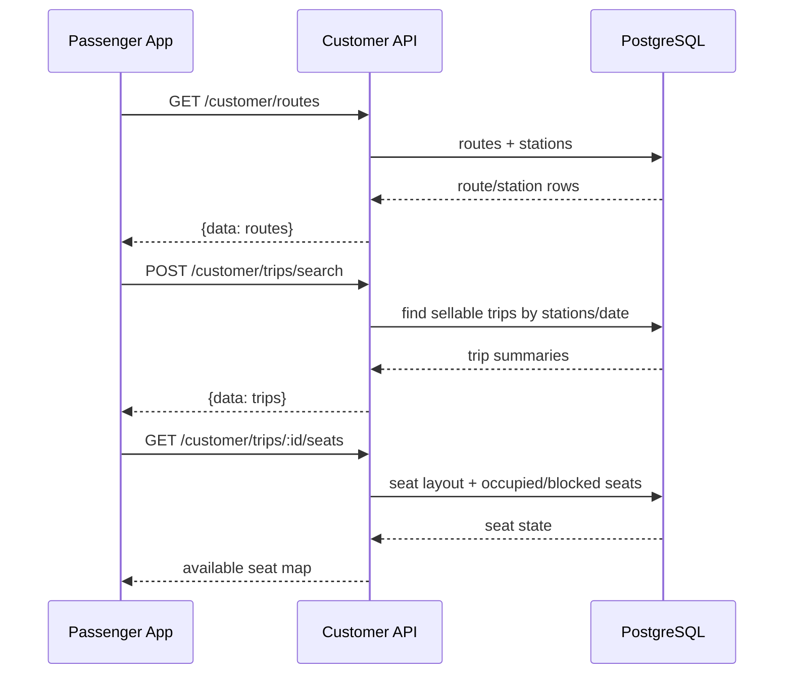
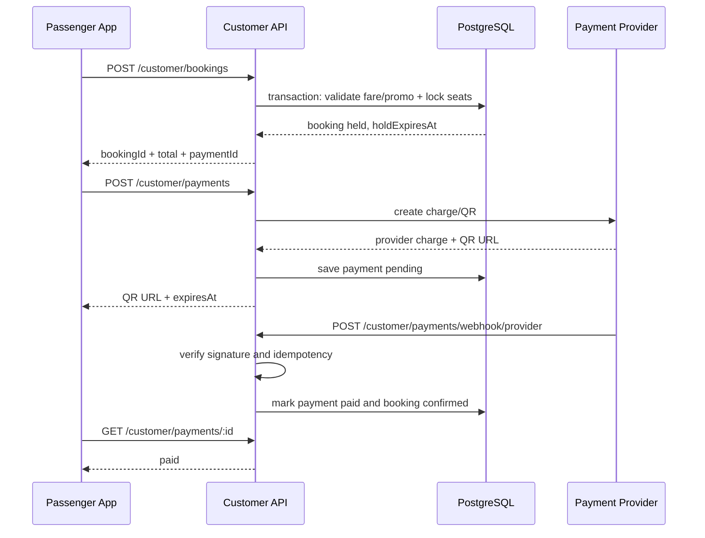
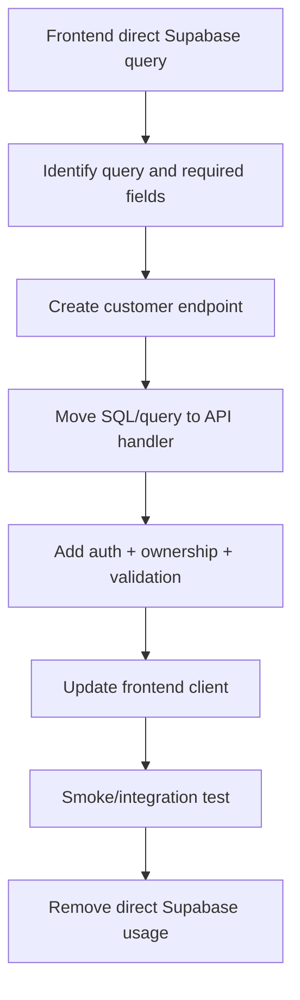

# API Migration Analysis: `go-glee` → `nova-express-1/api`

เอกสารนี้เป็นผลการตรวจสอบแบบ read-only ของ API ที่แอป `go-glee` ใช้อยู่ในปัจจุบัน เทียบกับ endpoint ที่มีอยู่ใน `nova-express-1/api`

ขอบเขตของเอกสาร:

- ตรวจ path, HTTP method, request และ response ที่ frontend ปัจจุบันเรียก
- ตรวจ endpoint และ OpenAPI contract ใน `nova-express-1/api`
- ระบุ endpoint ที่ใช้แทนได้ทันที, ใช้ได้หลังปรับ adapter/contract และ endpoint ที่ต้องเขียนใหม่
- ระบุจุดที่ frontend อ่าน Supabase โดยตรงและแนวทางย้ายไป backend API
- ยังไม่มีการแก้ source code, database migration หรือ OpenAPI

## 1. สรุปผลสำหรับการตัดสินใจ

ไม่ควรเปลี่ยน base URL ของแอปไปยัง `nova-express-1/api` แล้วใช้ path เดิมทั้งหมด เพราะระบบทั้งสองมีคนละบริบท:

| หัวข้อ | `go-glee` ปัจจุบัน | `nova-express-1/api` ปัจจุบัน |
|---|---|---|
| กลุ่มผู้ใช้ | ผู้โดยสาร/สมาชิก | พนักงานขายและผู้ดูแลระบบ |
| Base path | `/api/...` | `/api/v1/...` |
| Authentication | email/password, LINE, refresh token | username/password และ session ของพนักงาน |
| รูปแบบข้อมูล | object/array ตรง ๆ เป็นส่วนใหญ่ | `{ data, meta }` เป็นส่วนใหญ่ |
| Pagination | `page`, `limit` | `offset`, `limit` |
| Booking | จองออนไลน์โดยผู้โดยสาร | ขายตั๋วที่ counter/สาขา |
| Payment | QR, Alipay, WeChat และสถานะ payment | `POST /bookings` รองรับ `cash` เท่านั้น |
| Database access | มีการ query Supabase จาก browser โดยตรง | API query PostgreSQL จาก server |

ข้อสรุปคือควรใช้สองชั้นร่วมกัน:

1. Reuse query และ business logic ที่เหมาะสมจาก API ใหม่ เช่น routes, route stops, trips, seat layout, fares และ products
2. เพิ่ม customer-facing API namespace เช่น `/api/v1/customer/...` สำหรับแอปผู้โดยสาร
3. ย้าย Supabase access ทั้งหมดไปอยู่หลัง API ก่อนถอด Supabase client ออกจาก frontend

## 2. สถานะการรองรับ

คำอธิบายสถานะ:

- **ใช้ได้เลย** — path/method และความหมายใกล้เคียงกันมาก ใช้โดยเปลี่ยน base path หรืออ่าน response wrapper เล็กน้อย
- **ใช้ได้หลังปรับ** — มี resource เดียวกัน แต่ request, response, authorization หรือ semantics ต่างกัน ต้องมี adapter หรือแก้ contract
- **ต้องเขียนใหม่** — API ใหม่ไม่มี resource หรือ business flow นี้
- **ไม่ควรใช้แทน** — มี path ชื่อใกล้กัน แต่คนละกลุ่มผู้ใช้/ความปลอดภัย/ธุรกิจ

## 3. Inventory ของ API เดิม

### 3.1 Authentication และผู้ใช้

| Path เดิม | Method | Request | Response ที่ frontend คาดหวัง | สถานะกับ API ใหม่ |
|---|---|---|---|---|
| `/api/auth/login` | POST | `{ email, password }` | `{ token, refresh_token?, user? }` | **ต้องเขียนใหม่สำหรับ customer**; `/api/v1/auth/login` รับ `username` และเป็นพนักงาน |
| `/api/auth/register` | POST | `{ fullName, phone, email, password }` | token + user | **ต้องเขียนใหม่** |
| `/api/auth/line` | POST | `{ lineAccessToken }` | token + user | **ต้องเขียนใหม่** |
| `/api/auth/refresh` | POST | `{ refresh_token }` | token ชุดใหม่ | **ต้องเขียนใหม่** |
| `/api/auth/logout` | POST | `refresh_token` + Bearer | success | **ใช้ได้หลังปรับ**; API ใหม่มี `/api/v1/auth/logout` แต่ใช้ employee session |
| `/api/users/me` | GET | Bearer | passenger profile | **ไม่ควรใช้แทน**; `/api/v1/auth/me` คืน employee/group/permission |
| `/api/users/me` | PATCH | profile fields | passenger profile | **ต้องเขียนใหม่** |

### 3.2 เส้นทาง จังหวัด จุดขึ้นลง และเที่ยวรถ

| Path เดิม | Method | Request | Response | สถานะ |
|---|---|---|---|---|
| `/api/routes` | GET | ไม่มี | route list ที่ frontend map เป็น `g_route_id` | **ใช้ได้หลังปรับ** จาก `/api/v1/routes`; response ใหม่เป็น paginated และ field ต่างกัน |
| `/api/provinces` | GET | `routeId?` | provinces พร้อม `routeIds` | **ต้องเขียนใหม่หรือเพิ่ม customer projection**; API ใหม่มี stations/routes แต่ไม่มี provinces model แบบเดิม |
| `/api/boarding-points` | GET | `provinceId?` | boarding points | **ใช้ได้หลังปรับ** จาก `/api/v1/stations` แต่ต้อง filter และ map เป็น province/boarding point |
| `/api/bus-stops` | GET | `routeId` | stops พร้อม `stopOrder` | **ใช้ได้หลังปรับ** จาก `/api/v1/route-stops?routeId=` |
| `/api/trips` | POST | `{ routeId?, originProvinceId, destinationProvinceId, date?, passengerCount?, sort? }` | trip array | **ต้องเขียนใหม่เป็น customer search**; API ใหม่มี `GET /api/v1/sale-trips?serviceDate=` แต่ค้นตาม origin/destination ไม่ได้ |
| `/api/trips/:id` | GET | trip id | trip detail | **ใช้ได้หลังปรับ** จาก `/api/v1/sale-trips/:id`; ต้องเปิด customer authorization |
| `/api/trips/:id/seats` | GET | trip id | `{ tripId, layout, seats }` | **ใช้ได้หลังปรับ** จาก `/api/v1/sale-trips/:id`; response ใหม่รวม occupied/blocked seats |
| `/api/trips/:id/add-ons` | GET | `page`, `limit` | add-ons | **ใช้ได้หลังปรับ** จาก `/api/v1/products`; ต้องกำหนด product scope และ mapping |

### 3.3 Booking, ticket และ tracking

| Path เดิม | Method | Request | Response | สถานะ |
|---|---|---|---|---|
| `/api/bookings` | POST | trip/date/stations/passengers/promo/add-ons/payment | booking id/status/total | **ใช้ได้หลังปรับมาก** จาก `/api/v1/bookings`; API ใหม่เป็น counter sale และรับ cash เท่านั้น |
| `/api/bookings` | GET | `page`, `limit` + Bearer | bookings ของผู้ใช้ | **ต้องเขียน customer variant**; API ใหม่ list bookings ตามบริษัท/สาขา |
| `/api/bookings/:id` | GET | id + Bearer | booking/ticket detail | **ใช้ได้หลังปรับ** จาก `/api/v1/bookings/:id/ticket` แต่ต้องตรวจ owner/customer |
| `/api/bookings/:id/cancel` | PATCH | body ว่าง | success/message | **ต้องเขียนใหม่หรือเพิ่ม customer refund/cancel policy**; API ใหม่ใช้ refund flow |
| `/api/checkin/self` | POST | `{ ticketNumber, qrCode }` | check-in result | **ต้องเขียนใหม่** |
| `/api/trips/:id/driver-location` | GET | Bearer | driver location | **ต้องเขียนใหม่** |
| `/api/trips/:id/passenger-location` | POST | `{ latitude, longitude, accuracy_m }` | update result | **ต้องเขียนใหม่** |

### 3.4 Payment

| Path เดิม | Method | Request | Response | สถานะ |
|---|---|---|---|---|
| `/api/payment/qr` | POST | amount + booking detail | charge id + QR URL | **ต้องเขียนใหม่** |
| `/api/payment/alipay-qr` | POST | amount + booking detail | charge id + QR URL | **ต้องเขียนใหม่** |
| `/api/payment/wechat-pay` | POST | amount + booking detail | charge id + QR URL | **ต้องเขียนใหม่** |
| `/api/payment/transaction/:chargeId` | GET | charge id | payment status/detail | **ต้องเขียนใหม่** |
| `/api/payment/cancel/:chargeId` | POST | body ว่าง | cancelled result | **ต้องเขียนใหม่** |

API ใหม่มี payment semantics เป็นเงินสดใน `POST /api/v1/bookings` จึงไม่สามารถใช้แทน online payment ได้

### 3.5 Promotion, points, wallet และเนื้อหา

| Path เดิม | Method | Request | สถานะ |
|---|---|---|---|
| `/api/promotions` | GET | member/route/day/time/phone filters | **ต้องเขียนใหม่** |
| `/api/promotions/:id` | GET | id | **ต้องเขียนใหม่** |
| `/api/promotions/validate` | POST | `{ promoCode, tripId }` | **ต้องเขียนใหม่** |
| `/api/points` | GET | Bearer | **ต้องเขียนใหม่** |
| `/api/points/history` | GET | Bearer | **ต้องเขียนใหม่** |
| `/api/wallet` | GET | Bearer | **ต้องเขียนใหม่** |
| `/api/preferences` | GET | ไม่มี | **ต้องเขียนใหม่หรือรวมใน customer config** |
| `/api/contents/faqs` | GET | `category?` | **ต้องเขียนใหม่** |
| `/api/complaints` | POST | complaint fields | **ต้องเขียนใหม่** |

## 4. Endpoint ใน `nova-express-1/api` ที่มีอยู่แล้ว

### 4.1 ใช้เป็นฐานได้ทันที

รายการนี้มี handler และ OpenAPI อยู่แล้ว แต่คำว่า “ใช้ได้ทันที” หมายถึงใช้เป็น backend building block; ยังไม่ควร expose ให้ passenger โดยตรงจนเพิ่ม customer authorization และ response contract:

| Endpoint ใหม่ | Method | Request/Query | Response หลัก | ใช้กับของเดิม |
|---|---|---|---|---|
| `/api/v1/auth/login` | POST | `{username,password}` | `{data: auth}` | employee login เท่านั้น |
| `/api/v1/auth/me` | GET | Bearer | `{data: user, group, permissions}` | ไม่แทน passenger profile |
| `/api/v1/auth/logout` | POST | Bearer | `{data:{loggedOut:true}}` | ใช้กับ employee session |
| `/api/v1/routes` | GET | `limit`, `offset` | `{data:[routes],meta}` | route catalog |
| `/api/v1/route-stops` | GET | `routeId`, `limit`, `offset` | `{data:[stops],meta}` | bus stops |
| `/api/v1/trips` | GET | `serviceDate?`, `limit`, `offset` | `{data:[trips],meta}` | admin trip list |
| `/api/v1/sale-trips` | GET | `serviceDate` | `{data:{trips,availableDates,settings}}` | customer trip source candidate |
| `/api/v1/sale-trips/:id` | GET | trip id | `{data:{trip,stops,passengerTypes,fares,occupiedSeats,blockedSeats}}` | trip detail + seats |
| `/api/v1/stations` | GET | `limit`, `offset` | `{data:[stations],meta}` | boarding/drop-off source |
| `/api/v1/passenger-types` | GET | `limit`, `offset` | `{data:[passengerTypes],meta}` | passenger type selector |
| `/api/v1/products` | GET | filters, `limit`, `offset` | `{data:[products],meta}` | add-ons candidate |
| `/api/v1/bookings` | POST | `BookingInput` | `{data: booking}`, status 201 | counter booking core |
| `/api/v1/bookings` | GET | `limit`, `offset` | `{data:[bookings],meta}` | admin booking list |
| `/api/v1/bookings/:id/ticket` | GET | booking id | `{data: printable ticket}` | ticket data candidate |
| `/api/v1/bookings/:id/refund` | POST | refund request | `{data: refund}`, status 201 | refund base |
| `/api/v1/refunds` | GET | `limit`, `offset` | `{data:[refunds],meta}` | admin refund list |

### 4.2 ต้องปรับก่อนนำมาใช้กับ `go-glee`

1. **Authentication** — แยก customer token/session จาก employee `users` และ `auth_sessions`
2. **Authorization** — customer เห็นเฉพาะ booking ของตนเอง; employee permission/menu access ไม่เหมาะกับ mobile passenger
3. **Response adapter** — แปลง `{data,meta}` เป็นรูปแบบที่ `src/services/api.ts` และหน้าจอเดิมคาดหวัง หรือแก้ client ให้ใช้ contract ใหม่ทั้งชุด
4. **Field mapping** — API ใหม่ใช้ UUID, station fields และ snake_case หลายจุด; frontend เดิมใช้ province/route fields แบบเดิมและบางส่วนเป็น camelCase
5. **Pagination** — แปลง `page` เป็น `offset = (page - 1) * limit`
6. **Company/branch scope** — customer booking ไม่ควรถูกบังคับให้เลือก `branchId` แบบ counter sale
7. **Payment** — ต้องแยก online payment ก่อน reuse booking transaction

## 5. Endpoint ที่ต้องเขียนเพิ่ม

แนะนำ namespace แยกดังนี้:

```text
/api/v1/customer/...
```

### 5.1 Customer authentication

#### `POST /api/v1/customer/auth/register`

Request:

```json
{
  "fullName": "สมชาย ใจดี",
  "phone": "0812345678",
  "email": "user@example.com",
  "password": "secret"
}
```

Response `201`:

```json
{
  "data": {
    "accessToken": "...",
    "refreshToken": "...",
    "user": {
      "id": "uuid",
      "fullName": "สมชาย ใจดี",
      "phone": "0812345678",
      "email": "user@example.com"
    }
  }
}
```

#### `POST /api/v1/customer/auth/login`

Request: `{ email, password }`

Response: รูปแบบเดียวกับ register

#### `POST /api/v1/customer/auth/line`

Request: `{ lineAccessToken }`

Response: access/refresh token และ customer profile

#### `POST /api/v1/customer/auth/refresh`

Request: `{ refreshToken }`

Response: `{ data: { accessToken, refreshToken } }`

#### `POST /api/v1/customer/auth/logout`

Request: `{ refreshToken? }` + Bearer

Response: `{ data: { loggedOut: true } }`

#### `GET /api/v1/customer/me`

Request: Bearer

Response: `{ data: PassengerProfile }`

#### `PATCH /api/v1/customer/me`

Request fields ที่อนุญาต: `fullName`, `phone`, `email`, `avatarUrl`, `idType`, `idNumber`

Response: profile ที่แก้แล้ว

### 5.2 Customer catalog และ trip search

| Path | Method | Request | Response |
|---|---|---|---|
| `/api/v1/customer/config` | GET | company/host context | company detail, sales settings, preferences |
| `/api/v1/customer/routes` | GET | `limit`, `offset` | `{data:[Route],meta}` |
| `/api/v1/customer/provinces` | GET | `routeId?` | `{data:[Province]}` |
| `/api/v1/customer/boarding-points` | GET | `provinceId?`, `routeId?` | `{data:[BoardingPoint]}` |
| `/api/v1/customer/route-stops` | GET | `routeId` | `{data:[RouteStop]}` |
| `/api/v1/customer/trips/search` | GET or POST | origin/destination/date/passengers/sort | `{data:[TripSummary]}` |
| `/api/v1/customer/trips/:id` | GET | trip id | `{data:{trip,stops,fares,passengerTypes}}` |
| `/api/v1/customer/trips/:id/seats` | GET | trip id | `{data:{layout,seats,occupiedSeats,blockedSeats}}` |
| `/api/v1/customer/trips/:id/add-ons` | GET | `limit`, `offset` | `{data:[Product],meta}` |

ข้อเสนอ: ใช้ `POST /trips/search` หากต้องการรักษา request เดิมที่มี body และรองรับ filter เพิ่มในอนาคต; ใช้ `GET` หากต้องการ cache/search URL ได้ง่าย

### 5.3 Customer booking

#### `POST /api/v1/customer/bookings`

Request ที่แนะนำ:

```json
{
  "tripId": "uuid",
  "travelDate": "2026-08-13",
  "originStationId": "uuid",
  "destinationStationId": "uuid",
  "contactName": "สมชาย ใจดี",
  "contactPhone": "0812345678",
  "contactEmail": "user@example.com",
  "promoCode": "PROMO10",
  "useStamp": false,
  "passengers": [
    {
      "seatId": "uuid",
      "seatNumber": "A1",
      "fullName": "สมหญิง ใจดี",
      "thaiId": "1234567890123",
      "phone": "0812345678",
      "passengerType": "adult"
    }
  ],
  "addOns": [
    { "productId": "uuid", "quantity": 1 }
  ],
  "paymentMethod": "promptpay"
}
```

Response `201`:

```json
{
  "data": {
    "bookingId": "uuid",
    "bookingNo": "BK-20260813-0001",
    "status": "pending_payment",
    "subtotal": 500,
    "discountAmount": 50,
    "addOnAmount": 0,
    "total": 450,
    "paymentId": "uuid",
    "holdExpiresAt": "2026-08-13T12:05:00Z"
  }
}
```

กติกาที่ควรอยู่ server:

- ตรวจว่า trip ยังเปิดขายและวันที่ตรงกัน
- lock seat และป้องกัน double booking ใน transaction
- คำนวณ fare และส่วนลดเอง ห้ามเชื่อยอดเงินจาก frontend
- validate promo จาก server
- กำหนดเวลาถือที่นั่ง (`holdExpiresAt`)
- ผูก `customerId` กับ booking

#### `GET /api/v1/customer/bookings`

Query: `status?`, `limit`, `offset`

Response:

```json
{
  "data": [
    {
      "id": "uuid",
      "bookingNo": "BK-20260813-0001",
      "status": "confirmed",
      "tripId": "uuid",
      "routeName": "กรุงเทพฯ - เชียงใหม่",
      "serviceDate": "2026-08-13",
      "scheduledDeparture": "2026-08-13T08:00:00+07:00",
      "totalAmount": 450
    }
  ],
  "meta": { "limit": 10, "offset": 0 }
}
```

#### `GET /api/v1/customer/bookings/:id`

Response ควรรวม ticket, passengers, seats, payment, company contact และ QR/ticket data

#### `POST /api/v1/customer/bookings/:id/cancel`

Request: `{ reason? }`

Response: `{ data: { id, status, refundId?, refundAmount? } }`

### 5.4 Payment

| Path | Method | Request | Response |
|---|---|---|---|
| `/api/v1/customer/payments` | POST | `{bookingId, method}` | payment id, provider charge id, QR URL, status, expiry |
| `/api/v1/customer/payments/:id` | GET | payment id | amount, status, paidAt, failure reason |
| `/api/v1/customer/payments/:id/cancel` | POST | ไม่มี | cancelled status |
| `/api/v1/customer/payments/webhook/:provider` | POST | provider payload + signature | acknowledgment |

รองรับ `method`: `promptpay`, `alipay`, `wechat_pay_mpm` ตาม API เดิม โดย backend เป็นผู้เรียก provider และตรวจ webhook/signature

### 5.5 Promotions, points, wallet, FAQ และ complaint

| Path | Method | Request | Response |
|---|---|---|---|
| `/api/v1/customer/promotions` | GET | `memberOnly`, `visibility`, `routeId`, `dayOfWeek`, `time`, `phone` | promotion list |
| `/api/v1/customer/promotions/:id` | GET | id | promotion detail |
| `/api/v1/customer/promotions/validate` | POST | `{promoCode,tripId}` | valid, discount, message |
| `/api/v1/customer/points` | GET | Bearer | point summary |
| `/api/v1/customer/points/history` | GET | Bearer, pagination | point transactions |
| `/api/v1/customer/wallet` | GET | Bearer | balance + transactions |
| `/api/v1/customer/faqs` | GET | `category?` | FAQ list |
| `/api/v1/customer/complaints` | POST | reporter/trip/seat/vehicle/text | complaint record |

### 5.6 Check-in และ tracking

| Path | Method | Request | Response |
|---|---|---|---|
| `/api/v1/customer/check-in` | POST | `{ticketNumber,qrCode}` | checked-in status/time |
| `/api/v1/customer/trips/:id/driver-location` | GET | Bearer | latitude, longitude, timestamp, accuracy |
| `/api/v1/customer/trips/:id/passenger-location` | POST | `{latitude,longitude,accuracy_m}` | accepted timestamp |

ต้องตรวจ customer ownership และสถานะตั๋วทุกครั้ง ไม่ควรให้ผู้ใช้ส่ง `userId` มาเอง

## 6. Supabase ที่ต้องย้ายมาเป็น API

พบการอ่าน Supabase จาก browser ในกลุ่มต่อไปนี้:

| จุดเดิม | ตาราง/ข้อมูล | API ใหม่ที่ควรสร้าง |
|---|---|---|
| `src/lib/company.ts` และ `Home.tsx` | `companies`, `company_sales_settings` | `GET /api/v1/customer/config` |
| `PassengerInfoSection.tsx` | `passenger_tiers` | รวมใน trip detail หรือ `GET /api/v1/customer/passenger-types` |
| `Home.tsx` | `routes` | `GET /api/v1/customer/routes` |
| `Home.tsx` | route lookup จาก `origin_id`, `destination_id` | `GET /api/v1/customer/routes/search` หรือรวมใน trip search |
| `Home.tsx` | `bookings` ของ user ที่ยังเดินทาง | `GET /api/v1/customer/bookings?status=upcoming,confirmed&paymentStatus=paid` |

หลักการสำคัญ:

- browser ไม่ควรมี service-role credential หรือ query ตารางโดยตรง
- API ต้องบังคับ row ownership และ company scope ใน server
- ตาราง customer/account และ employee account ควรแยกสิทธิ์ชัดเจน
- response จาก API ควรเป็น DTO ที่ไม่เปิด column ภายในโดยไม่จำเป็น

## 7. Diagram: ความสัมพันธ์ของระบบเดิมและระบบใหม่

```mermaid
flowchart LR
  UI[go-glee Passenger App]
  Old[Existing /api service]
  Supa[(Supabase tables)]
  Gateway[/api/v1 gateway]
  Admin[Existing nova-express Admin API]
  Customer[New /api/v1/customer API]
  DB[(PostgreSQL)]
  Pay[Payment Providers]

  UI --> Old
  UI -. direct reads today .-> Supa
  Old --> Supa
  UI --> Gateway
  Gateway --> Admin
  Gateway --> Customer
  Admin --> DB
  Customer --> DB
  Customer --> Pay
```

เป้าหมายคือเส้นประจาก UI ไป Supabase หายไป และทุก customer operation ผ่าน Customer API

## 8. Diagram: Trip search และ seat selection



## 9. Diagram: Booking และ payment



ถ้า payment หมดอายุ ต้องมี background job หรือ request-time cleanup เพื่อปล่อย seat hold และเปลี่ยน booking เป็น expired/cancelled

## 10. Diagram: การย้าย Supabase



## 11. รายการปรับใน frontend ที่คาดว่าจะต้องทำภายหลัง

ยังไม่ใช่การแก้ในรอบนี้ แต่ควรเตรียมไว้:

1. เปลี่ยน `VITE_API_URL` ให้ชี้ไป `/api/v1` หรือ gateway URL
2. เปลี่ยน `src/services/api.ts` ให้มี customer API client และ response unwrap ที่ชัดเจน
3. เพิ่ม Bearer interceptor/refresh flow สำหรับ customer token
4. เปลี่ยน field mapping จาก province/route แบบเดิมเป็น station/route DTO ใหม่
5. เปลี่ยน booking flow ให้รองรับ `holdExpiresAt` และ payment state
6. เปลี่ยน booking detail ไปใช้ endpoint ที่ตรวจ owner
7. ลบ query Supabase ใน `Home.tsx`, `PassengerInfoSection.tsx` และ `lib/company.ts`
8. เพิ่ม loading/error state สำหรับ `{data,meta}` และ HTTP error `{error:{code,message}}`

## 12. ลำดับการพัฒนา endpoint ใหม่

### Phase 1: Foundation

- customer account/session
- customer profile
- customer config
- routes/stations/route stops

### Phase 2: Booking discovery

- trip search
- trip detail
- seat layout/availability
- passenger types/products

### Phase 3: Transaction

- customer booking hold
- fare/promo calculation
- payment creation
- webhook/idempotency
- booking confirmation and ticket

### Phase 4: Post-booking

- booking list/detail/cancel
- check-in
- tracking
- complaint

### Phase 5: Membership/content

- LINE login
- points
- wallet
- promotions
- FAQ/preferences

## 13. Definition of Done ก่อนเปลี่ยน production

ต้องครบทุกข้อ:

- มี handler, OpenAPI schema และ test สำหรับทุก customer endpoint
- customer token แยกจาก employee token หรือมี role boundary ที่ตรวจสอบได้
- booking ใช้ database transaction และ seat locking
- payment webhook ตรวจ signature และรองรับ idempotency
- booking detail/list ตรวจ ownership
- ไม่มี frontend query ตาราง Supabase โดยตรง
- response contract ตรงกับ frontend และมี error format เดียวกัน
- รัน API smoke test, frontend lint และ production build ผ่าน
- อัปเดต README ของ `nova-express-1` เมื่อเพิ่ม API, permission, schema หรือสถานะ feature

## 14. สรุปสั้นที่สุด

- **ใช้เป็นฐานได้:** routes, route stops, stations, passenger types, sale trips, sale trip detail, products และ booking transaction บางส่วน
- **ต้องปรับหนัก:** login/logout, trip search, seats, booking detail/list, refund/cancel และ response/pagination mapping
- **ต้องเขียนใหม่:** customer auth/register/LINE/refresh, online payment, promotions, points, wallet, FAQ, complaints, check-in, tracking และ Supabase replacement endpoints
- **ห้ามใช้ตรง ๆ:** `/api/v1/auth/me`, `/api/v1/bookings` list และ employee permission endpoints กับ passenger app โดยไม่เพิ่ม customer ownership/authorization
